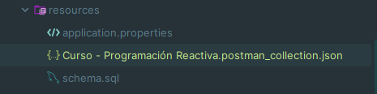

# Aplicación de Gestión de Eventos

### Descripción
Es una aplicación que proporcionará a los usuarios de forma
muy sencilla y simple una plataforma para descubrir, unirse y comentar
sobre eventos locales. Se irán implementando nuevas funcionalidades en el futuro.

### Entidades:
Se utilizaron cuatro entidades de dominio en total:
- Usuario
- Evento
- Comentario
- Ubicación

### Interfaces:
Se utilizaron las dos interfaces solicitadas:
- IOperacionesGenerales
- IOperacionSeguridad

### Salud de la aplicación:
Se implementó el endpoint de salud de la aplicación, el cual se puede encontrar en la siguiente ruta:

### Esquema de base de datos:
Se adicionó el esquema de la base de datos en la que consta de 10 usuarios, 10 eventos, 10 comentarios y 10 ubicaciones.

### Endpoints:
Todos los endpoints utilizados para la aplicación se podrán encontrar en la siguiente ruta y de allí poder exportarlos a Postman.

